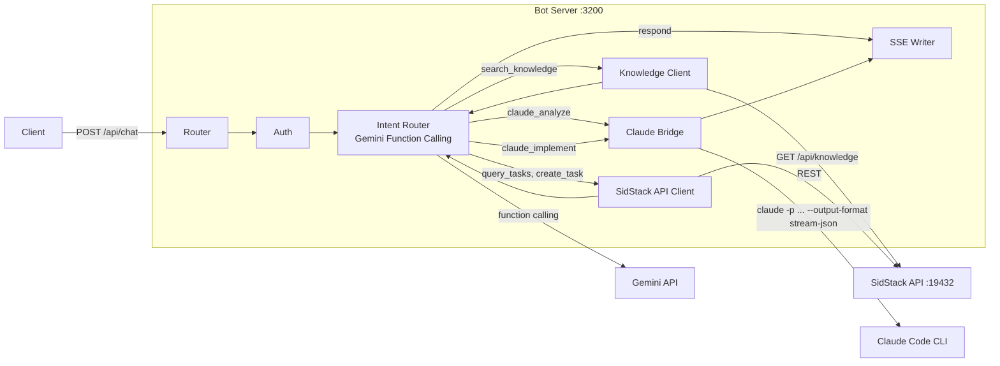

# SidBot - Backend Design (Bot Server)

> Dual-Brain server: Gemini function calling + Claude Code bridge. See [`API-SPEC.md`](./API-SPEC.md) for contract.

## Overview

The bot server is a **standalone Express.js service** that:
1. Receives user messages from the SidStack frontend
2. Uses **Gemini function calling** to classify intent and pick the right tool
3. Executes the tool: direct answer, knowledge search, SidStack API, or Claude Code CLI
4. Streams results back via SSE (Gemini tokens + Claude progress events)

## Architecture



## Components

| Component | Responsibility |
|-----------|---------------|
| Router | Express routes for 5 endpoints |
| Auth Middleware | Validates `X-API-Key` header |
| Intent Router | Sends message + tool defs to Gemini, executes returned function call |
| Knowledge Client | Calls SidStack API `/api/knowledge/search` for project docs |
| SidStack API Client | Calls task/ticket/training endpoints on `:19432` |
| Claude Bridge | Spawns `claude -p` process, parses NDJSON stream, emits progress SSE |
| SSE Writer | Formats and writes SSE events to response |
| Conversation Store | In-memory history (last 20 turns, 1h TTL) |

## Gemini Tool Definitions

```typescript
const tools = [
  { name: "respond", description: "Answer directly for help, FAQ, navigation", parameters: { text: "string" } },
  { name: "search_knowledge", description: "Search project knowledge docs", parameters: { query: "string" } },
  { name: "query_tasks", description: "List/search tasks", parameters: { filter: "string?" } },
  { name: "query_tickets", description: "List/search tickets", parameters: { filter: "string?" } },
  { name: "navigate", description: "Switch app view", parameters: { view: "string" } },
  { name: "create_task", description: "Create a new task", parameters: { title: "string", description: "string?" } },
  { name: "open_doc", description: "Open documentation", parameters: { docId: "string" } },
  { name: "claude_analyze", description: "Analyze code (read-only, for questions about code)", parameters: { prompt: "string" } },
  { name: "claude_implement", description: "Implement changes (write code, fix bugs)", parameters: { prompt: "string", taskId: "string?" } },
  { name: "claude_resume", description: "Resume previous Claude session", parameters: { sessionId: "string" } },
];
```

## System Prompt (~500 tokens)

```
You are SidBot, the orchestrator for SidStack — an AI project intelligence platform.

ROLE: Understand what the user needs and call the RIGHT tool. You do NOT answer code questions yourself.

ROUTING RULES:
1. Help/FAQ/navigation → respond()
2. Questions about project docs/modules → search_knowledge()
3. "Show my tasks" / "What's blocked?" → query_tasks()
4. Questions about CODE → claude_analyze() (Claude reads the actual files)
5. "Fix this" / "Implement X" → claude_implement() (Claude writes code)
6. ALWAYS try search_knowledge() BEFORE claude_analyze() — knowledge is free, Claude costs money.

VIEWS: project-hub, task-manager, knowledge, ticket-queue, training-room, settings
CURRENT PROJECT: {{projectName}}
CURRENT VIEW: {{activeView}}
```

## Claude Bridge

**Spawn**: `claude -p "{prompt}" --output-format stream-json` in `context.projectPath`

**NDJSON parsing**:

| Event type | Action |
|-----------|--------|
| `system` | Log session_id, emit `claude_start` SSE |
| `assistant` (text) | Buffer for final summary |
| `tool_use` | Emit `claude_progress` SSE with tool name + input |
| `tool_result` | Emit `claude_progress` SSE with result summary |
| `result` | Emit `claude_end` SSE, feed to Gemini for summary |
| `error` | Emit `error` SSE |

**After Claude completes**: Send Claude's result text to Gemini with prompt "Summarize this for the user in 2-3 sentences". Gemini generates the final response tokens.

## Environment Variables

| Variable | Default | Description |
|----------|---------|-------------|
| `PORT` | `3200` | Server port |
| `GEMINI_API_KEY` | — | Default Gemini API key |
| `SIDSTACK_API_URL` | `http://localhost:19432` | SidStack API server |
| `CLAUDE_PATH` | auto-detect | Path to Claude Code CLI binary |
| `LOG_LEVEL` | `info` | debug, info, warn, error |
| `CORS_ORIGINS` | `tauri://localhost,http://localhost:*` | Allowed origins |

## Error Handling

| Scenario | Behavior |
|----------|----------|
| Invalid API key | 401 before stream |
| Gemini rate limit | 429 with retry hint |
| Claude CLI not found | 503 `CLAUDE_UNAVAILABLE` |
| Claude timeout (>60s) | Emit `error` SSE + `claude_end` + `done` |
| Knowledge search empty | Gemini falls back to `respond()` or `claude_analyze()` |

## Tech Stack

| Dependency | Purpose |
|-----------|---------|
| `express` | HTTP server |
| `@google/generative-ai` | Gemini SDK with function calling |
| `child_process` | Spawn Claude Code CLI |
| `cors` | CORS middleware |
| `zod` | Request validation |

## File Structure

```
packages/bot-server/
├── src/
│   ├── index.ts              # Express app entry
│   ├── routes/chat.ts        # POST /api/chat, cancel, delete
│   ├── services/
│   │   ├── intent-router.ts  # Gemini function calling orchestration
│   │   ├── knowledge-client.ts  # SidStack knowledge API client
│   │   ├── sidstack-api.ts   # SidStack task/ticket API client
│   │   ├── claude-bridge.ts  # Spawn CLI, parse NDJSON, emit progress
│   │   └── conversation.ts   # In-memory conversation store
│   ├── middleware/auth.ts
│   └── utils/sse.ts
├── package.json
├── tsconfig.json
└── Dockerfile
```
