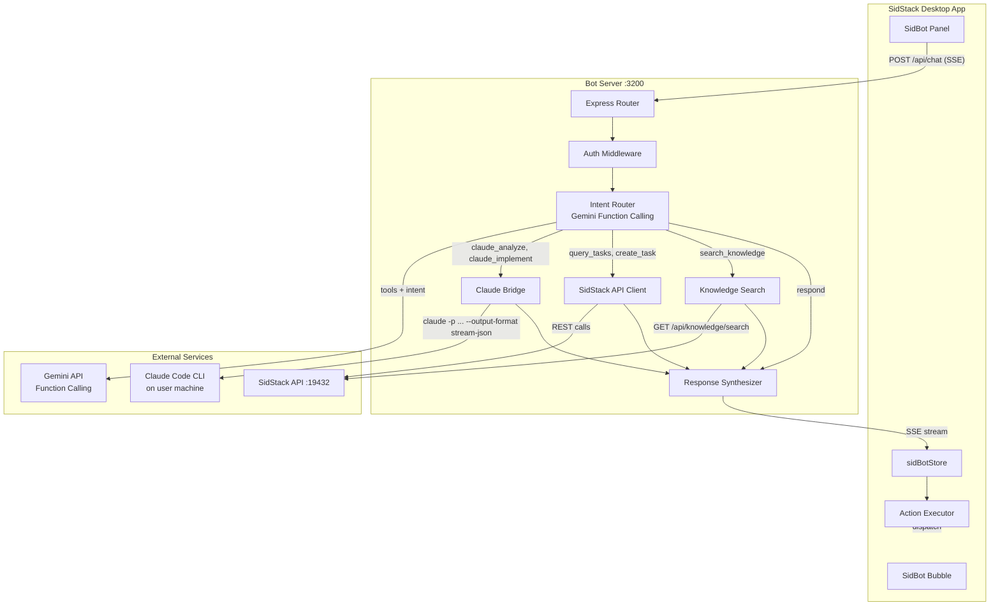
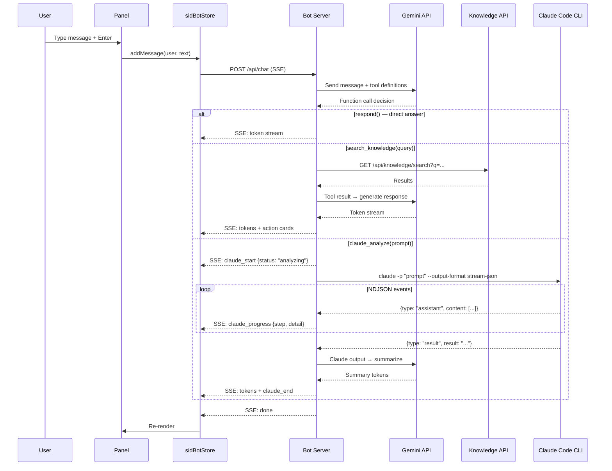

# SidBot - System Design

> Dual-Brain Orchestrator. See [`PROPOSAL-DUAL-BRAIN.md`](./PROPOSAL-DUAL-BRAIN.md) for concept. See [`API-SPEC.md`](./API-SPEC.md) for contract.

## Component Diagram



## Message Flow (Sequence)



## Component Boundaries

| Component | File Path | Responsibility |
|-----------|-----------|---------------|
| SidBotBubble | `src/components/sidbot/SidBotBubble.tsx` | Floating button, 5 state indicators |
| SidBotPanel | `src/components/sidbot/SidBotPanel.tsx` | Panel container, open/close animation |
| SidBotMessages | `src/components/sidbot/SidBotMessages.tsx` | Message list, auto-scroll, streaming |
| SidBotInput | `src/components/sidbot/SidBotInput.tsx` | Textarea, send/cancel buttons |
| SidBotActionCard | `src/components/sidbot/SidBotActionCard.tsx` | Clickable action card |
| SidBotProgressCard | `src/components/sidbot/SidBotProgressCard.tsx` | Claude Code execution progress |
| SidBotWelcome | `src/components/sidbot/SidBotWelcome.tsx` | Empty state with quick actions |
| SidBotConfig | `src/components/sidbot/SidBotConfig.tsx` | Server URL, API key, model |
| sidBotStore | `src/stores/sidBotStore.ts` | Messages, streaming, config, claude status |

## State Shape

```typescript
interface SidBotStore {
  // Config
  serverUrl: string;              // default: "http://localhost:3200"
  isConnected: boolean;
  selectedModel: string;
  // Conversation
  conversationId: string | null;
  messages: SidBotMessage[];
  isStreaming: boolean;           // Gemini token streaming
  streamingText: string;
  abortController: AbortController | null;
  // Claude Code delegation
  claudeStatus: "idle" | "analyzing" | "implementing" | "done" | "error";
  claudeProgress: { step: string; detail: string } | null;
  claudeSessionId: string | null;
  // UI
  isPanelOpen: boolean;
  hasUnread: boolean;
  activeTab: "chat" | "config";
  // Actions
  togglePanel: () => void;
  sendMessage: (text: string) => Promise<void>;
  cancelStream: () => void;
  executeAction: (action: SidBotAction) => void;
  testConnection: () => Promise<boolean>;
  clearConversation: () => void;
}
```

## Security Considerations

| Concern | Mitigation |
|---------|-----------|
| Gemini API key in frontend | Sent per-request to bot server, never stored on disk unencrypted |
| XSS via bot/Claude responses | Rendered via existing `MarkdownPreview` which sanitizes HTML |
| Claude Code execution safety | One-shot mode is read-only; implement mode requires user confirmation |
| Bot server CORS | Restricts to `tauri://localhost` and `http://localhost:*` |

## Integration Map

| Existing System | Integration | Change |
|----------------|-------------|--------|
| `App.tsx` | Mount `<SidBotBubble />` + `<SidBotPanel />` at z-[60] | Add 2 components |
| `packages/api-server/` | Bot server calls REST endpoints for knowledge, tasks, tickets | No changes |
| Claude Code CLI | Bot server spawns via `claude -p` or persistent mode | No changes |
| `src/stores/appStore.ts` | Bot reads `activeViewId`, `projectPath` for context | Read-only |
| Training Room | After Claude completes, bot suggests lesson capture via API | No changes |

## Performance Budget

| Metric | Budget |
|--------|--------|
| Gemini first-token (direct answer) | P95 < 2s |
| Gemini first-token (after knowledge search) | P95 < 3s |
| Claude Code one-shot (analysis) | P95 < 15s |
| Panel open animation | < 200ms |
| Bundle size (sidbot components) | < 50KB gzipped |
