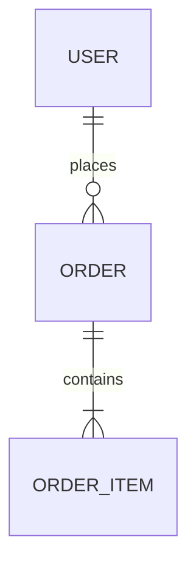

# Database Schema

Document your database schema, tables, and relationships.

## Overview

<!-- Add your database overview here -->



## Tables

<!-- Add links to table documentation -->

## Table Template

```markdown
---
id: table-name
type: database-table
module: module-name
status: implemented
---

# Table: table_name

## Description
What this table stores.

## Schema
| Column | Type | Nullable | Default | Description |
|--------|------|----------|---------|-------------|
| id | uuid | NO | gen_random_uuid() | Primary key |
| created_at | timestamp | NO | now() | Creation time |

## Relationships
- `user_id` → `users.id` (many-to-one)

## Indexes
- `idx_table_column` on (column)

## Code References
- `prisma/schema.prisma:line`
- `src/models/table.ts:line`
```

## Migrations

<!-- Track migration history -->

| Version | Date | Description |
|---------|------|-------------|
| 001 | 2026-01-01 | Initial schema |
